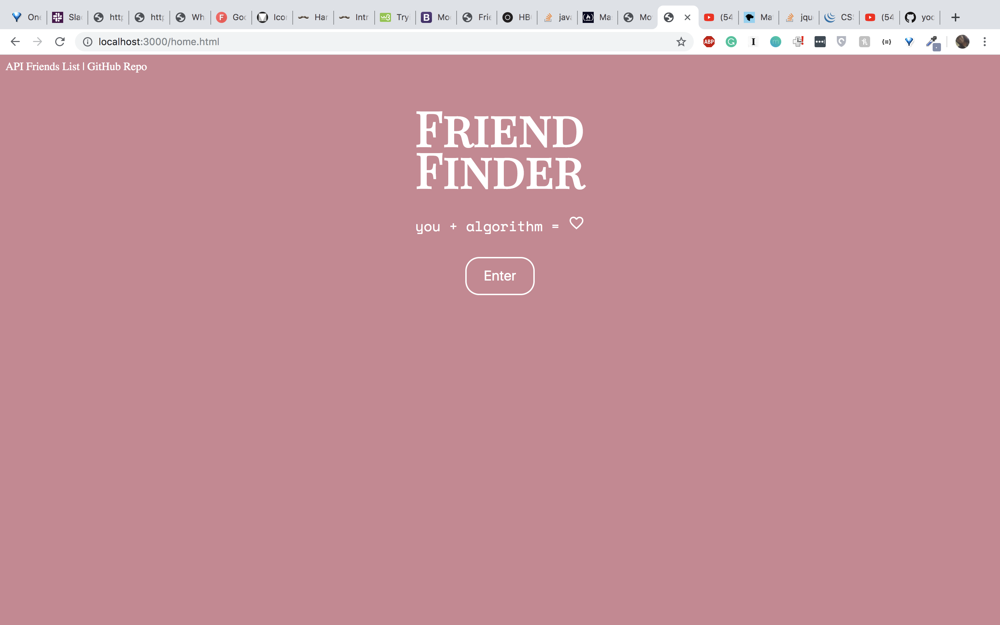
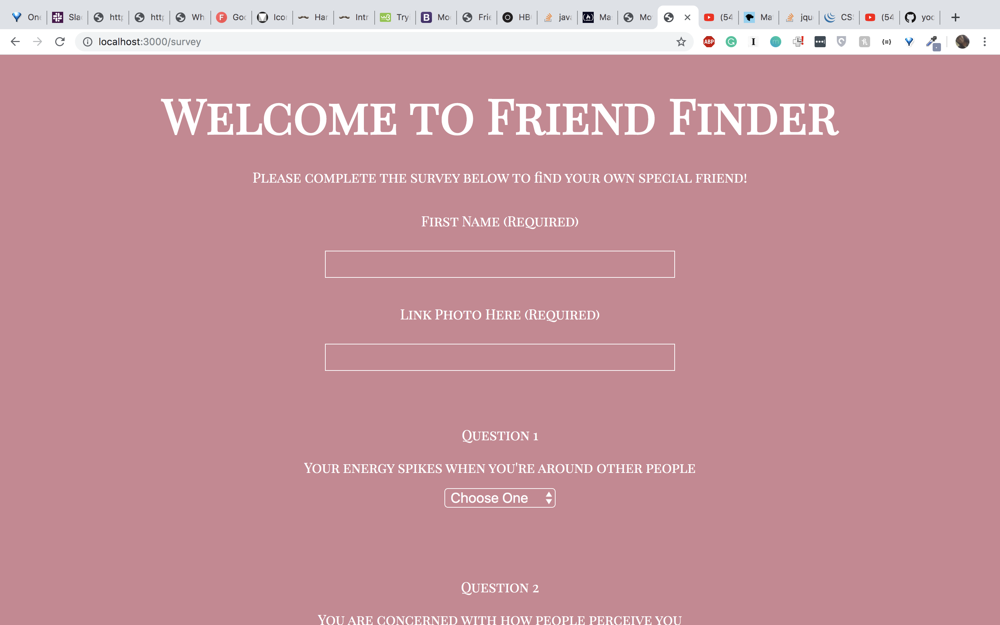
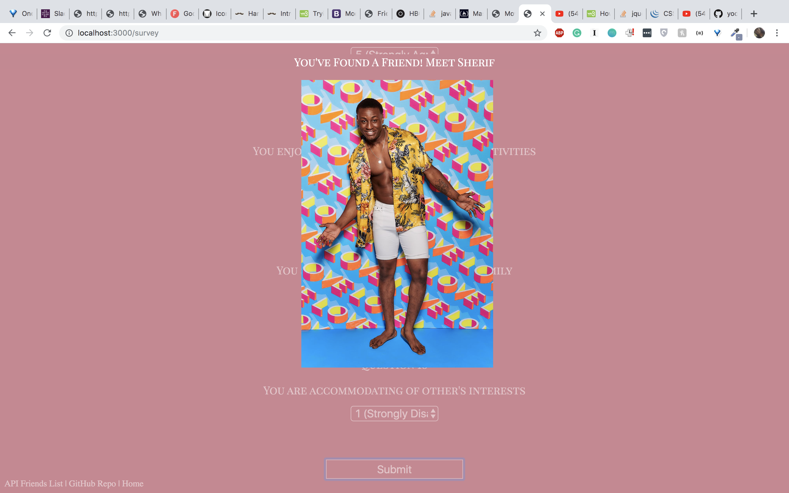

# friendFinder

Welcome to Friend Finder, your ultimate friend finding tool! Using proprietary code, along with your own personal information, we've created the perfect algorithm that will find you the perfect person to be your friend. 

# The App

The page opens on a simple landing page that allows you to enter to the survey

Once inside the survey, the user inputs their name, a link to an image, and they can begin answering the questions

Once the user has answered all the questions, a match is made! No need to open yet another tab, the friend will pop up on a modal displayed on the page. 

# Technologies Used

- Javascript
- JQuery
- HTML/CSS
- Express.js
- node.js

# Links 

* [Deployed GitHub](https://gelissa.github.io/friendFinder/)
* [GitHub Repo](https://github.com/gelissa/friendFinder)
* [Portfolio]()
* [Heroku]()